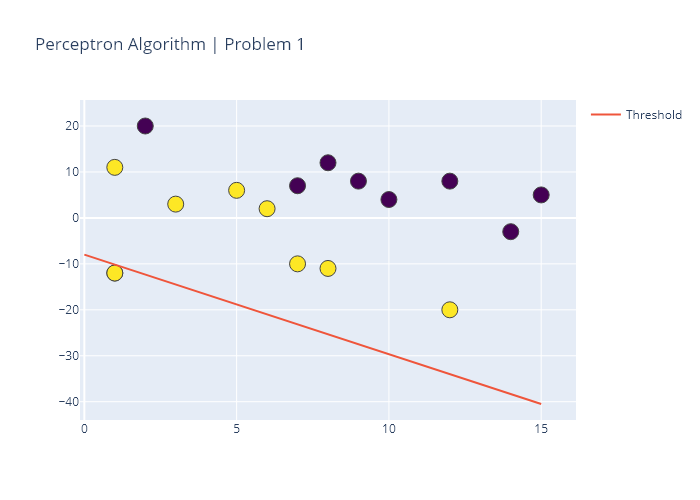
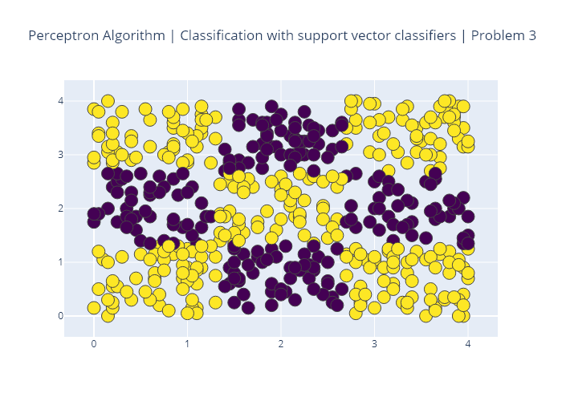
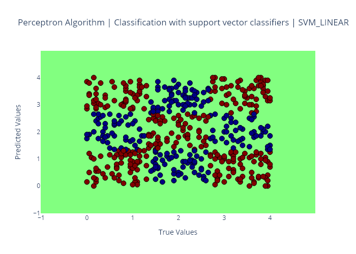
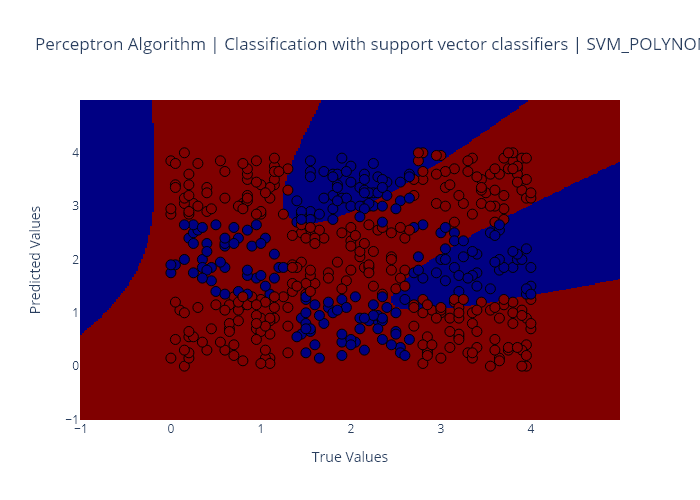
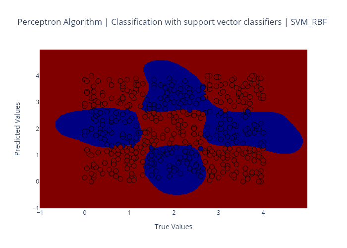
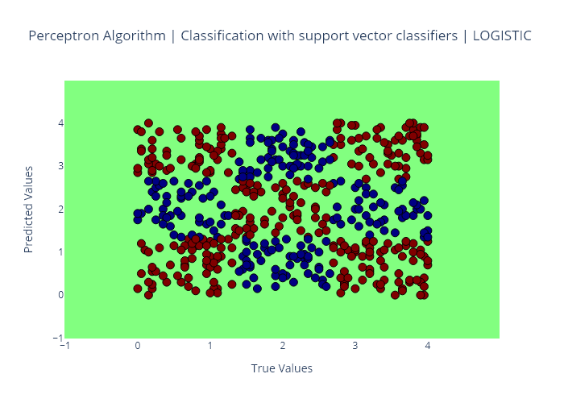
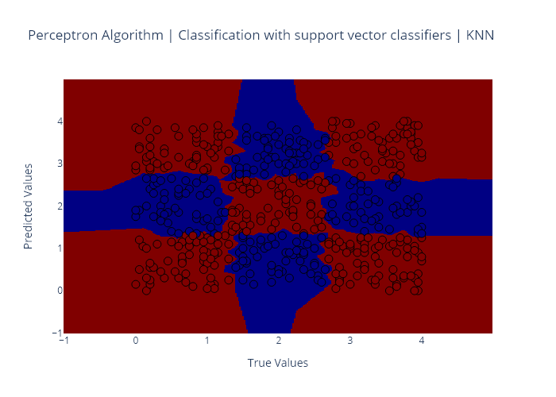
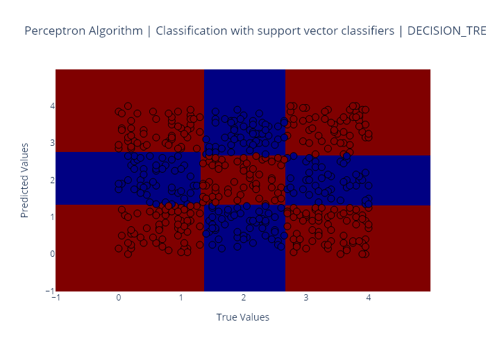
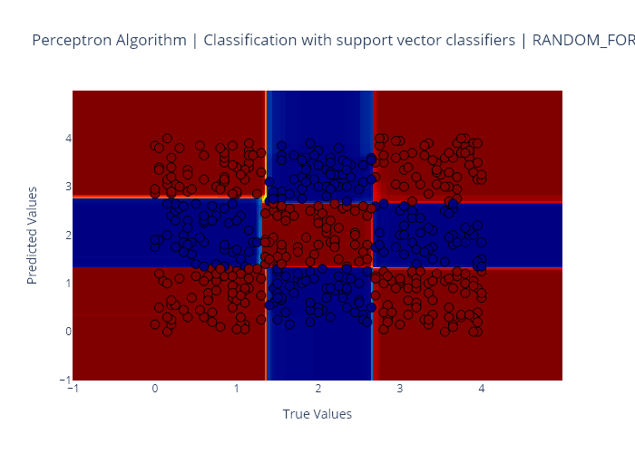

# AI-PerceptronLearningAlgorithm-A3
The assignment includes three problems as detailed below:
1. Perceptrong Learning Algorithm
2. Multivariate Linear Regression
3. Classification with support vector classifiers

## Problem 1: Perceptron Learning Algorithm

This code implements the perceptron learning algorithm ("PLA") for a linearly separable dataset.

First, we visualise the dataset which contains 2 features. We can see that the dataset can be clearly separated by drawing a straight line between them. The goal is to write an algorithm that finds that line and classifies all of these data points correctly.

The output csv file contains the values of w1, w2 and b which define the 'threshold' line. The last row will be the most accurate one. Each time it goes through each of the examples in 'input1.csv', it adds a new line to the output file containing a comma-separated list of the weights w_1, w_2, and b (bias) in that order. 

Upon convergence, the program stops, and the final values of w_1, w_2, and b are printed to the output file (output1.csv). This defines the decision boundary that your PLA has computed for the given dataset.

### About the Python version

The code in the main folder is written for python 3.7 and it includes plotting functions (plotly). However those are disabled when executing the code in python 3.6 from the command line in the format specified below for Vocareum. Refer to subfolder py36 for a version of the code that runs in python 3.6 and Vocareum.

**Execute as from Vocareum (version python 3.6)***
$ python3 problem1.py input1.csv output1.csv

### Example of outputs for Python 3.7 version 

The following is a sample of the output obtained when running the code in problem1.py as it is in Python 3.7.

Example:

### Useful references:

- [Perceptron Learning and its implementation in Python](https://towardsdatascience.com/perceptron-and-its-implementation-in-python-f87d6c7aa428) by [Pallavi Bharadwaj](https://medium.com/@pallavibharadwaj)
- [Calculate the Decision Boundary of a Single Perceptron - Visualizing Linear Separability](https://medium.com/@thomascountz/calculate-the-decision-boundary-of-a-single-perceptron-visualizing-linear-separability-c4d77099ef38) by [Thomas Countz](https://medium.com/@thomascountz)
- [19-line Line-by-line Python Perceptron](https://medium.com/@thomascountz/19-line-line-by-line-python-perceptron-b6f113b161f3) by [Thomas Countz](https://medium.com/@thomascountz)

## Problem 2: Multivariate Linear Regression Algorithm

In this problem, we work on linear regression with multiple features using gradient descent. 

Running the code will generate an output file called output2.csv containing a comma-separated list of:
- alpha (slope)
- number_of_iterations (n = 100 as required in the assignment)
- betas values for: b_0, b_age, and b_weight (the two last betas are the features in X)

A total of ten entries are produced, one per learning rate applied. Nine learning rates were provided in the assignment. The last learning rate is my own choice. Learning rates are as follows: [0.001, 0.005, 0.01, 0.05, 0.1, 0.5, 1, 5, 10, 0.02]

The outputs csv file represent the regression models that the gradient descents have computed for the given dataset.

### About the Python version

As above for problem 1.

**Execute as from Vocareum (version python 3.6)***
$ python3 problem2.py input2.csv output2.csv

### Useful references:

- [Multivariate Linear Regression from Scratch in Python](https://medium.com/@lope.ai/multivariate-linear-regression-from-scratch-in-python-5c4f219be6a) by [Lope.AI](https://medium.com/@lope.ai)
- [Multivariate Linear Regression in Python Step by Step](https://towardsdatascience.com/multivariate-linear-regression-in-python-step-by-step-128c2b127171) by [Rashida Nasrin Sucky](https://medium.com/@sucky00)
- [Gradient Descent in Python](https://towardsdatascience.com/gradient-descent-in-python-a0d07285742f) by [Sagar Mainkar](https://medium.com/@sagarmainkar)
- [Implement Gradient Descent in Python](https://towardsdatascience.com/implement-gradient-descent-in-python-9b93ed7108d1) by [Rohan Joseph](https://medium.com/@rohanjoseph_91119)
- [Youtube video explaining difference between single feature and multivariate](https://www.youtube.com/watch?v=7r0fsvgTtHA) by [intrigano](https://www.youtube.com/channel/UCDf3VLjM5A4MntJvCfls4sQ)

## Problem 3: Classification with support vector classifiers

This code implements a support vector classifier using the sklearn package to learn a classification model for a chessboard-like dataset. 

The input dataset is available as input3.csv. The first step is to make a scatter plot of the dataset showing the two classes with two different patterns. The result is this plot:

Next, we use SVM with different kernels to build a classifier. We split the data into training (60%) and testing (40%). We are also using **stratified sampling** (i.e. same ratio of positive to negative in both the training and testing datasets). It requires using the option **stratify** from [sklearn.train_test_split](https://scikit-learn.org/stable/modules/generated/sklearn.model_selection.train_test_split.html) on the 'y' vector, which is the 'label' column of the input dataset.

The assignment also asks to use cross validation (with the number of folds k = 5) instead of a validation set. However, scaling/normalising the data is not required for this question of the assignment. As anticipated above, we will use the **train-test splitting** and **cross validation** functionalities readily available in **sklearn** as follows:
- [sklearn.model_selection.train_test_split](https://scikit-learn.org/stable/modules/generated/sklearn.model_selection.train_test_split.html)
- [sklearn.model_selection.cross_validate](https://scikit-learn.org/stable/modules/generated/sklearn.model_selection.cross_validate.html)

## C-support vector classification

For this part we will use sklearn [C-support vector classification](https://scikit-learn.org/stable/modules/generated/sklearn.svm.SVC.html).

We will use [sklearn.grid_search](https://scikit-learn.org/stable/modules/generated/sklearn.model_selection.GridSearchCV.html) to find the optimal parameters using the training data. Next, we record the corresponding best score (training data accuracy) achieved. Then we apply the testing data to the model, and record the actual test score. Both scores will be a number between zero and one which we will need to reflect in the outputs csv file.

### SVM with Linear Kernel
Observe the performance of the SVM with linear kernel. Use sklearn.grid_search to find a good setting of parameters to obtain high classification accuracy. 
Specifically, try values of C = [0.1, 0.5, 1, 5, 10, 50, 100]. 

### SVM with Polynomial Kernel
As above for linear kernel but now try values of C = [0.1, 1, 3], degree = [4, 5, 6], and gamma = [0.1, 0.5].

### SVM with RBF Kernel
As above but now try values of C = [0.1, 0.5, 1, 5, 10, 50, 100] and gamma = [0.1, 0.5, 1, 3, 6, 10].

### Logistic Regression
As above with values of C = [0.1, 0.5, 1, 5, 10, 50, 100].

### k-Nearest Neighbors
As above with values of n_neighbors = [1, 2, 3, ..., 50] and leaf_size = [5, 10, 15, ..., 60].

### Decision Trees
As above with values of max_depth = [1, 2, 3, ..., 50] and min_samples_split = [2, 3, 4, ..., 10].

### Random Forest
As above with values of max_depth = [1, 2, 3, ..., 50] and min_samples_split = [2, 3, 4, ..., 10].

### Submission details
A file named 'output3.csv' including: 

- an entry for each of the seven methods used;
- for each method, print a comma-separated list as shown in the example including: 
	- method name, 
	- best score,
	- test score
- metrics need to be expressed with as many decimal places as you possible. 

Overview of output3.csv to be populated:	
	svm_linear,[best_score],[test_score]
	svm_polynomial,[best_score],[test_score]
	svm_rbf,[best_score],[test_score]
	logistic,[best_score],[test_score]
	knn,[best_score],[test_score]
	decision_tree,[best_score],[test_score]
	random_forest,[best_score],[test_score]

### About the Python version

As above for problem 1.

**Execute as from Vocareum (version python 3.6)***
$ python3 problem3.py input3.csv output3.csv

### Plotting the results

#### Initial dataset

#### SVM with Linear Kernel

#### SVM with Polynomial Kernel

#### SVM with RBF Kernel

#### Logistic Regression

#### k-Nearest Neighbors

#### Decision Trees

#### Random Forest

### Useful references:

- [Stratified Test Train Split](https://www.kaggle.com/vaasha/stratified-test-train-split).
- [Train/Test Split and Cross Validation in Python](https://towardsdatascience.com/train-test-split-and-cross-validation-in-python-80b61beca4b6) by [Adi Bronshtein](https://medium.com/@adi.bronshtein).
- [Grid Search with Logistic Regression](https://www.kaggle.com/enespolat/grid-search-with-logistic-regression) by [Enes Polat](https://www.kaggle.com/enespolat) and [ML Model_selection Hyperparameter tuning using grid_search](https://chrisalbon.com/machine_learning/model_selection/hyperparameter_tuning_using_grid_search/) by [Chris Albon](https://chrisalbon.com/) specifically for the logistic regression.
- [k-Neighbors Classifier with GridSearchCV Basics](https://medium.com/@erikgreenj/k-neighbors-classifier-with-gridsearchcv-basics-3c445ddeb657) by [Erik G.](https://medium.com/@erikgreenj) specifically for K-nearest neighbours.
- [DecisionTree Classifier — Working on Moons Dataset using GridSearchCV to find best hyperparameters](RandomForestRegressor) by [Rohit Madan](https://medium.com/@madanflies) and [Extracting the best fitted DecisionTreeClassifier after Grid Search](https://discuss.analyticsvidhya.com/t/extracting-the-best-fitted-decisiontreeclassifier-after-grid-search/10029) by [Syed Danish](https://discuss.analyticsvidhya.com/u/syed.danish) specifically for decision trees.
- [Hyperparameter Tuning the Random Forest in Python](https://towardsdatascience.com/hyperparameter-tuning-the-random-forest-in-python-using-scikit-learn-28d2aa77dd74) by [Will Koehrsen](https://medium.com/@williamkoehrsen) and [Random Forest using GridSearchCV](https://www.kaggle.com/sociopath00/random-forest-using-gridsearchcv) by  specifically for random forests.
-[Decision Boundaries visualised via Python & Plotly](https://www.kaggle.com/arthurtok/decision-boundaries-visualised-via-python-plotly) for plotting using plotly libraries.
