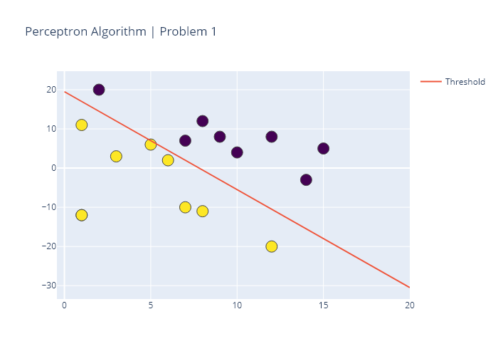

# AI-PerceptronLearningAlgorithm-A3
The assignment includes three problems as detailed below:
1. Perceptrong Learning Algorithm
2. Multivariate Linear Regression
3. Classification with support vector classifiers

## Problem 1: Perceptron Learning Algorithm

This code implements the perceptron learning algorithm ("PLA") for a linearly separable dataset.

First, we visualise the dataset which contains 2 features. We can see that the dataset can be clearly separated by drawing a straight line between them. The goal is to write an algorithm that finds that line and classifies all of these data points correctly.

The output csv file contains the values of w1, w2 and b which define the 'threshold' line. The last row will be the most accurate one. Each time it goes through each of the examples in 'input1.csv', it adds a new line to the output file containing a comma-separated list of the weights w_1, w_2, and b (bias) in that order. 

Upon convergence, the program stops, and the final values of w_1, w_2, and b are printed to the output file (output1.csv). This defines the decision boundary that your PLA has computed for the given dataset.

### About the Python version

The code in the main folder is written for python 3.7 and it includes plotting functions (plotly). However those are disabled when executing the code in python 3.6 from the command line in the format specified below for Vocareum. Refer to subfolder py36 for a version of the code that runs in python 3.6 and Vocareum.

**Execute as from Vocareum (version python 3.6)***
$ python3 problem1.py input1.csv output1.csv

### Example of outputs for Python 3.7 version 

The following is a sample of the output obtained when running the code in problem1.py as it is in Python 3.7.

Example:

### Useful references:

- [Perceptron Learning and its implementation in Python](https://towardsdatascience.com/perceptron-and-its-implementation-in-python-f87d6c7aa428) by [Pallavi Bharadwaj](https://medium.com/@pallavibharadwaj)
- [Calculate the Decision Boundary of a Single Perceptron - Visualizing Linear Separability](https://medium.com/@thomascountz/calculate-the-decision-boundary-of-a-single-perceptron-visualizing-linear-separability-c4d77099ef38) by [Thomas Countz](https://medium.com/@thomascountz)
- [19-line Line-by-line Python Perceptron](https://medium.com/@thomascountz/19-line-line-by-line-python-perceptron-b6f113b161f3) by [Thomas Countz](https://medium.com/@thomascountz)

## Problem 2: Multivariate Linear Regression Algorithm

In this problem, we work on linear regression with multiple features using gradient descent. 

Running the code will generate an output file called output2.csv containing a comma-separated list of:
- alpha (slope)
- number_of_iterations (n = 100 as required in the assignment)
- betas values for: b_0, b_age, and b_weight (the two last betas are the features in X)

A total of ten entries are produced, one per learning rate applied. Nine learning rates were provided in the assignment. The last learning rate is my own choice. Learning rates are as follows: [0.001, 0.005, 0.01, 0.05, 0.1, 0.5, 1, 5, 10, 0.02]

The outputs csv file represent the regression models that the gradient descents have computed for the given dataset.

### About the Python version

As above for problem 1.

**Execute as from Vocareum (version python 3.6)***
$ python3 problem2.py input2.csv output2.csv

### Useful references:

- [Multivariate Linear Regression from Scratch in Python](https://medium.com/@lope.ai/multivariate-linear-regression-from-scratch-in-python-5c4f219be6a) by [Lope.AI](https://medium.com/@lope.ai)
- [Multivariate Linear Regression in Python Step by Step](https://towardsdatascience.com/multivariate-linear-regression-in-python-step-by-step-128c2b127171) by [Rashida Nasrin Sucky](https://medium.com/@sucky00)
- [Gradient Descent in Python](https://towardsdatascience.com/gradient-descent-in-python-a0d07285742f) by [Sagar Mainkar](https://medium.com/@sagarmainkar)
- [Implement Gradient Descent in Python](https://towardsdatascience.com/implement-gradient-descent-in-python-9b93ed7108d1) by [Rohan Joseph](https://medium.com/@rohanjoseph_91119)
- [Youtube video explaining difference between single feature and multivariate](https://www.youtube.com/watch?v=7r0fsvgTtHA) by [intrigano](https://www.youtube.com/channel/UCDf3VLjM5A4MntJvCfls4sQ)

## Problem 3: Classification with support vector classifiers

This code implements a support vector classifier using the sklearn package to learn a classification model for a chessboard-like dataset. 

The input dataset is available as input3.csv. The first step is to make a scatter plot of the dataset showing the two classes with two different patterns. The result is this plot:

Use SVM with different kernels to build a classifier. Make sure you split your data into training (60%) and testing (40%). Also make sure you use stratified sampling (i.e. same ratio of positive to negative in both the training and testing datasets). Use cross validation (with the number of folds k = 5) instead of a validation set. You do not need to scale/normalize the data for this question. Train-test splitting and cross validation functionalities are all readily available in sklearn.

SVM with Linear Kernel. Observe the performance of the SVM with linear kernel. Search for a good setting of parameters to obtain high classification accuracy. Specifically, try values of C = [0.1, 0.5, 1, 5, 10, 50, 100]. Read about sklearn.grid_search and how this can help you accomplish this task. After locating the optimal parameter value by using the training data, record the corresponding best score (training data accuracy) achieved. Then apply the testing data to the model, and record the actual test score. Both scores will be a number between zero and one.
SVM with Polynomial Kernel. (Similar to above).
Try values of C = [0.1, 1, 3], degree = [4, 5, 6], and gamma = [0.1, 0.5].
SVM with RBF Kernel. (Similar to above).
Try values of C = [0.1, 0.5, 1, 5, 10, 50, 100] and gamma = [0.1, 0.5, 1, 3, 6, 10].
Logistic Regression. (Similar to above).
Try values of C = [0.1, 0.5, 1, 5, 10, 50, 100].
k-Nearest Neighbors. (Similar to above).
Try values of n_neighbors = [1, 2, 3, ..., 50] and leaf_size = [5, 10, 15, ..., 60].
Decision Trees. (Similar to above).
Try values of max_depth = [1, 2, 3, ..., 50] and min_samples_split = [2, 3, 4, ..., 10].
Random Forest. (Similar to above).
Try values of max_depth = [1, 2, 3, ..., 50] and min_samples_split = [2, 3, 4, ..., 10].
What To Submit. output3.csv (see example). Please follow the exact format, with no extra commas, change in upper/lower case etc. Extra unnecessary commas may make the automated script fail and result in you losing points. There is no need to submit your actual program. The file should contain an entry for each of the seven methods used. For each method, print a comma-separated list as shown in the example, including the method name, best score, and test score, expressed with as many decimal places as you please. There may be more than one way to implement a certain method, and we will allow for small variations in output you may encounter depending on the specific functions you decide to use.
